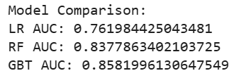
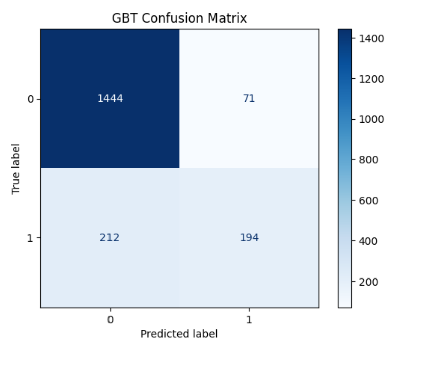

# 🏦 Bank Customer Churn Prediction

A machine learning project that predicts whether a bank customer will churn (leave the bank) using classification models and data analysis techniques. This project also provides actionable insights that can help banks improve customer retention.

---

## 📌 Problem Statement

Customer churn is a major challenge for banks as acquiring new customers is more expensive than retaining existing ones.
The goal of this project is to build a machine learning model that can predict whether a customer is likely to churn based on demographic and financial data.

---

## 📊 Dataset

* Source: Public bank churn dataset (commonly used in ML projects)
* Features include:

  * Age
  * Geography
  * Gender
  * Balance
  * Credit score
  * Tenure
  * Number of products
  * Estimated salary

---

## 🛠 Tech Stack

* Python
* Pandas & NumPy (Data processing)
* Matplotlib & Seaborn (Visualization)
* Scikit-learn (Machine Learning)
* Google Colab

---

## 🔍 Project Workflow

1. Data preprocessing and cleaning
2. Exploratory Data Analysis (EDA)
3. Feature encoding and scaling
4. Model training using multiple algorithms:

   * Logistic Regression
   * Decision Tree
   * Random Forest
5. Model evaluation and comparison

---

## 📈 Results

* Best Model: **Random Forest Classifier**
* Accuracy: **~85%**
* ROC-AUC Score: **~0.88**
* The model effectively identifies high-risk churn customers.

---

## 📊 Model Performance Visualizations

### Model Comparison

### Confusion Matrix (GBT)

### ROC Curve (GBT)

## 💡 Key Insights

* Customers with lower balances are more likely to churn.
* Customers with fewer products show higher churn rates.
* Certain geographic regions show higher churn trends.
* Older customers tend to remain more loyal.

---

## 🚀 Future Improvements

* Deploy model using Streamlit for real-time predictions
* Hyperparameter tuning for better accuracy
* Use advanced models like XGBoost
* Build an interactive dashboard

---

## 🎯 Project Objective

This project demonstrates an end-to-end machine learning workflow including data analysis, model building, evaluation, and business insights.

---

## 📬 Author

**Meghana U**
