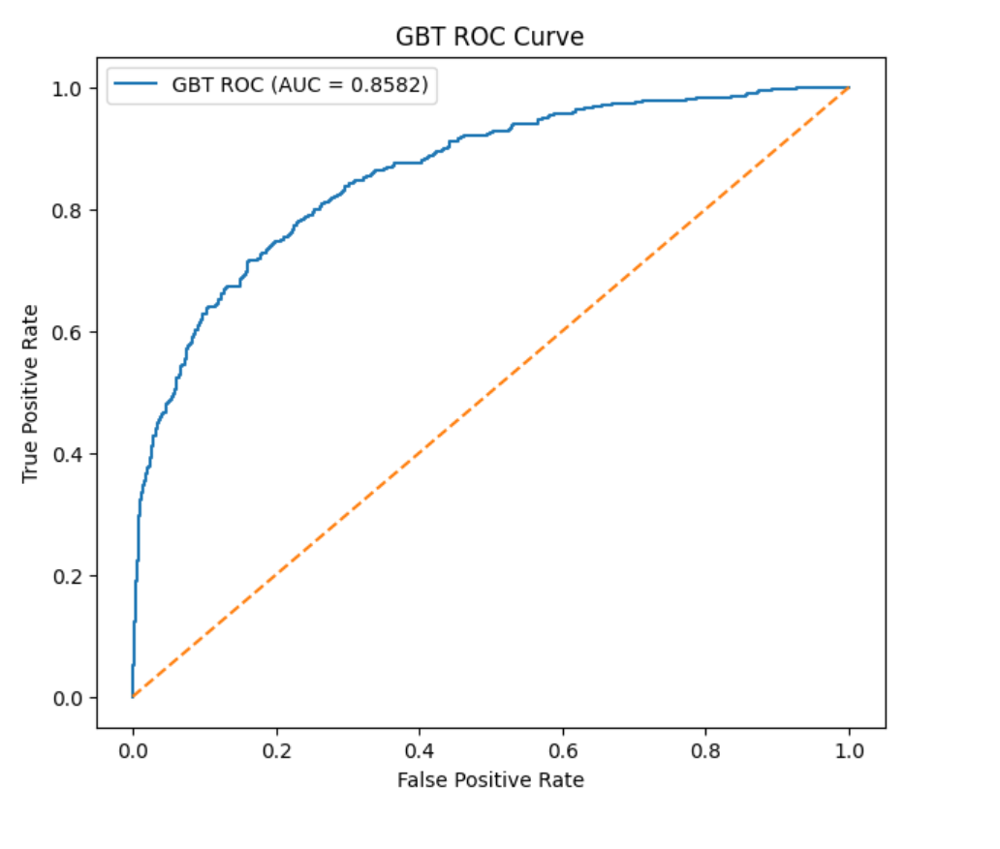

# 🏦 Bank Customer Churn Prediction (End-to-End ML Project)

An end-to-end machine learning project that predicts whether a bank customer will churn (leave the bank) using big data processing and a deployable web application.
This project combines **PySpark-based analysis** with a **Streamlit web app** for real-time predictions.

---

## 📌 Problem Statement

Customer churn is a major challenge for banks, as acquiring new customers is significantly more expensive than retaining existing ones.
The objective of this project is to build a predictive system that identifies customers at risk of churning using demographic and financial data.

---

## 🧠 Project Highlights

* Built scalable churn prediction using **PySpark MLlib**
* Compared multiple machine learning models
* Extracted business insights from customer behavior
* Deployed a **Streamlit web app** for real-time predictions
* Created a complete **analysis → deployment pipeline**

---

## 📊 Dataset

* Source: Public bank churn dataset
* Key features:

  * Credit Score
  * Geography
  * Gender
  * Age
  * Tenure
  * Account Balance
  * Number of Products
  * Estimated Salary

---

## 🛠 Tech Stack

**Data Processing & Modeling**

* Python
* PySpark (Big Data Processing)
* PySpark MLlib (Model Training)

**Visualization**

* Matplotlib / Seaborn

**Deployment**

* Streamlit (Web App)
* Joblib (Model Serialization)

---

## 🔍 Project Workflow

### 1️⃣ Data Processing (PySpark)

* Data cleaning and preprocessing
* Feature engineering
* Handling categorical encoding

### 2️⃣ Model Training

Trained and compared:

* Logistic Regression
* Random Forest
* Gradient Boosted Trees (GBT)

### 3️⃣ Evaluation

* ROC-AUC comparison
* Confusion Matrix
* Feature importance analysis

### 4️⃣ Deployment

* Trained lightweight deployment model
* Built Streamlit app for live predictions

---

## 📈 Results

* **Best Model:** Gradient Boosted Trees (GBT)
* Accuracy: ~85%
* ROC-AUC Score: ~0.85
* Successfully identifies high-risk churn customers

---

## 📊 Model Performance

### Model Comparison


### Confusion Matrix (GBT)


### ROC Curve (GBT)



---

## 🌐 Streamlit Web Application

This repository includes an interactive Streamlit web app for real-time churn prediction.

### Features

* User-friendly input interface
* Instant churn probability prediction
* Real-time ML inference

### ▶️ Run Locally

```bash
cd streamlit-app
streamlit run app.py
```

---

## 💡 Key Insights

* Customers with lower balances are more likely to churn
* Customers with fewer products have higher churn rates
* Geography plays a role in churn behavior
* Older customers tend to be more loyal

---

## 💼 Real-World Applications

* Customer retention prediction
* Banking risk analytics
* Personalized marketing strategies
* Revenue loss prevention

---

## 🚀 Future Improvements

* Deploy Streamlit app to cloud (Streamlit Cloud / AWS)
* Add model explainability (SHAP)
* Hyperparameter tuning
* Add dashboard analytics

---

## 🎯 Project Objective

This project demonstrates a complete machine learning lifecycle:

**Data Engineering → Model Building → Evaluation → Deployment**

It showcases practical skills in:

* Big data processing
* Machine learning
* Model deployment
* Full-stack ML development

---

## 👩‍💻 Author

**Meghana U**
CSE (AI & DS) Student

